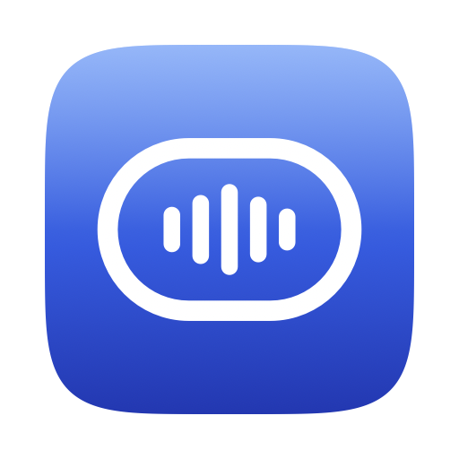

<div align="center">



# Voxi

**Hold a key. Speak. It types — and nothing leaves your Mac.**

Private dictation for macOS, powered by [Voxtral](https://huggingface.co/mistralai/Voxtral-Mini-4B-Realtime-2602)
running locally on Apple Silicon. No API key, no account, no cloud, no cost per word.

<sub>Apache 2.0 · a local-model fork of [Jot](https://github.com/google-gemini/jot-gemini-transcribe-macOS) by Ammaar Reshi</sub>

</div>

---

## What it is

Hold a key, say the thing, let go. A moment later your words are in the app you
were already using — punctuated, in any of 13 languages. No window to switch to,
no transcript to copy, no account to make, and no server on the other end.

It is deliberately small: a menu bar icon, a pill at the bottom of your screen
that shows your words as you say them, and a History window that proves nothing
was ever lost.

## Why local

Every other dictation tool of this kind sends your voice to someone's server.
Voxi runs the speech model on your own machine:

- **Private by construction.** The app makes exactly one network connection —
  to `127.0.0.1`, a model server it starts itself. Audio, transcripts, dictionary,
  history: all of it stays on disk here. Verify with Little Snitch or `nettop`;
  see [PRIVACY.md](docs/PRIVACY.md) for the complete list of what is stored.
- **Free to use, forever.** No per-minute API bill. A 30-second dictation costs
  a few seconds of GPU time.
- **Works offline.** On a plane, on a train, on a network you don't trust.
- **Multilingual.** Voxtral Mini 4B Realtime transcribes English, German,
  French, Spanish, Italian, Portuguese, Dutch, Russian, Arabic, Hindi, Chinese,
  Japanese and Korean — and switches between them without a setting.

## The three gestures

| Gesture | What happens |
| --- | --- |
| **Hold the dictation key** | Records while held. Release and the text lands at your cursor. |
| **Hold + tap `Space`** | Hands-free: keeps recording after you let go. Tap the key again to finish. |
| **`Esc`** | Cancels. Anything over 10 seconds is still kept in History. |

The dictation key is `fn` by default and rebindable in Settings → General
(Right ⌘ is a popular choice if `fn` is taken).

## What you get

**See your words as you speak.** Voxtral is a streaming model, so the pill shows
a live transcript while you talk. The final, authoritative text is decoded once
more at key-up and inserted — the preview can never cost you a word.

**It never loses your words.** Audio goes to disk from the first millisecond, so
a crash, a `kill -9`, or a flat battery costs you nothing — the recording is
recovered on next launch. If the model server is still warming up, the
dictation waits in History and retries. Release the key mid-word and it keeps
listening until you actually stop.

**Your jargon, spelled right.** Put names and product terms in the Dictionary.
Every transcript passes through your correction rules before it is inserted, so
"cooper netties" becomes "Kubernetes" every time.

**Long dictations work.** Ten minutes if you want; the audio is transcribed in
segments so accuracy holds over the whole recording.

## Install

There is no signed download yet — Voxi is built from source, which takes about
five minutes and one command each for the model and the app.

**Requirements**

- Apple Silicon Mac (M1 or newer). Intel is not supported: the model runs on
  [MLX](https://github.com/ml-explore/mlx).
- macOS 14 or later
- Xcode **Command Line Tools** (`xcode-select --install`) — full Xcode is not needed
- Python 3.11 or newer (`brew install python`)
- ~4 GB of disk for the model, 16 GB of RAM recommended

**Steps**

```bash
git clone https://github.com/arman-jalali/voxi.git
cd voxi
./scripts/install-server.sh          # Python venv + Voxtral weights (~2.7 GB, one-time download)
./scripts/make-signing-identity.sh   # once: local signing cert so permissions survive rebuilds
./scripts/build-app.sh               # builds and installs /Applications/Voxi.app
open /Applications/Voxi.app
```

Setup takes about two minutes and the app walks you through it:

1. **Local model check** — the app starts the model server itself; the first
   launch loads the weights and takes a minute, after that a few seconds.
2. **Allow the microphone** — say hello and it advances by itself.
3. **Allow Accessibility** — macOS requires this for any app that types into
   another app. Click *Grant*, add Voxi in System Settings, toggle it on. If the
   app doesn't notice, quit and reopen it.
4. **Hold the key and talk.**

> **Why the signing step?** macOS ties permission grants to an app's code
> signature. Without a certificate, each build is signed by its own hash — a new
> app to macOS — and the Accessibility/Microphone grants you gave the previous
> build silently stop applying while their rows still sit in System Settings.
> `make-signing-identity.sh` creates a self-signed certificate in your login
> keychain (it asks for your password once) and `build-app.sh` signs with it
> from then on, so grants survive rebuilds. If you skip it, after every rebuild
> you must remove the stale *Voxi* rows and add the app again.

## How it works

```
key down ─▶ capture (CAF on disk from t=0) ──▶ live preview ──▶ pill caption
                                              (PCM stream)
key up ──▶ WAV ──▶ local Voxtral server (MLX, 127.0.0.1:48765) ──▶ transcript
                                                                       │
        cursor ◀── insert (AX → paste → clipboard) ◀── Dictionary rules ◀┘
                                                              │
                                                        History (SQLite)
```

The model server is a small Python process (`server/voxi_server.py`) that loads
[Voxtral-Mini-4B-Realtime](https://huggingface.co/mistralai/Voxtral-Mini-4B-Realtime-2602)
in 6-bit via [voxmlx](https://github.com/awni/voxmlx) and answers two things:
a batch `/transcribe` and a streaming session used for the live caption. It runs
at roughly 7× realtime on an M-series Mac and stays warm between dictations.

A few decisions worth knowing about, because they are what make it feel solid:

- **The capture graph is pre-warmed while idle**, so a key press only pays
  `engine.start()` — 20–40 ms instead of 75–150 ms. Preparing is not recording:
  no audio flows and no mic indicator appears until you hold the key.
- **The mic drains one buffer past the stop**, because the audio tap only
  delivers whole ~100 ms chunks and tearing down immediately threw away the
  tail of your last word.
- **Long audio is decoded in ~20 s segments, cut at pauses.** The encoder's
  sliding attention window isn't applied by the MLX port, so a single long pass
  degrades after half a minute; segmenting keeps every window in-distribution.
- **Insertion is a ladder**: Accessibility API first (no clipboard involved),
  then a guarded paste that restores your clipboard, then a "copied — press ⌘V"
  chip. It never blind-pastes into an app that stole focus mid-flight.
- **The paths that can lose words are tested.** `JotCore` is a headless Swift
  package holding the state machine, hotkey grammar, audio, transcription,
  insertion and history — exercised without launching the app.

## Development

```bash
./scripts/install-server.sh   # once
./scripts/build-app.sh        # SwiftPM build, ad-hoc sign, install to /Applications
./scripts/test.sh             # swift test on JotCore
```

| Symptom | Cause |
| --- | --- |
| `No module named 'mlx'` / `ImportError: ... arm64` | Intel Mac or an x86 Python — MLX is Apple Silicon only |
| `python3: command not found` or Python < 3.11 | `brew install python` |
| `external macro implementation type 'PreviewsMacros...'` | a dependency with `#Preview` built under CLT — `Vendor/KeyboardShortcuts` already has these stripped; don't swap it for the upstream package |
| pill says *Local model isn't running* | run `~/Library/Application\ Support/Voxi/server.sh` and read its output |
| Accessibility granted but not detected | stale row from a previous ad-hoc build — remove it, add the app again, relaunch; run `make-signing-identity.sh` so it stops recurring |

```
App/            menu bar item, HUD pill, windows, design tokens, icon + sounds
JotCore/        engine logic, headless and testable
  HotkeyEngine/       CGEventTap + the pure hold/lock/cancel grammar
  AudioEngine/        crash-safe CAF capture, device changes, prewarming, PCM tap
  TranscriptionClient/  Voxtral client, WAV encode, live preview, timeouts
  FormattingPipeline/   dictionary replacement rules
  InsertionEngine/      the AX → paste → clipboard ladder
  HistoryStore/         GRDB index, recovery, retry queue, retention
server/         voxi_server.py (batch + streaming HTTP) and stream_session.py
Vendor/         KeyboardShortcuts, vendored with #Preview blocks removed
scripts/        install-server, build-app, test, icon, DMG
docs/           privacy, design specs (some upstream docs describe Jot's Xcode flow)
```

Useful while hacking:

```bash
open "jot://settings/about"      # or /general /dictation /privacy /advanced
open "jot://history"  "jot://dictionary"  "jot://onboarding/5"

log show --last 5m --info --predicate 'subsystem == "com.voxi.app"'
curl -s http://127.0.0.1:48765/health
```

Transcript text is logged as `private` and never appears in those logs.

## Credits

Voxi is a fork of [Jot](https://github.com/google-gemini/jot-gemini-transcribe-macOS)
by [Ammaar Reshi](https://x.com/ammaar) — the hotkey grammar, crash-safe audio
engine, insertion ladder and the pill UI are his work. Voxi replaces the cloud
transcription with a local model and adds the live preview.

The model is [Voxtral Mini 4B Realtime](https://huggingface.co/mistralai/Voxtral-Mini-4B-Realtime-2602)
by Mistral AI (Apache 2.0), run through [voxmlx](https://github.com/awni/voxmlx)
by Awni Hannun (MIT) on Apple's [MLX](https://github.com/ml-explore/mlx).
Not affiliated with Google, Mistral AI or Apple.

## License

Apache License 2.0 — see [LICENSE](LICENSE). Bundled fonts (Google Sans Flex,
Google Sans Code) are SIL OFL 1.1. Full attributions in
[THIRD_PARTY_NOTICES.md](THIRD_PARTY_NOTICES.md).
